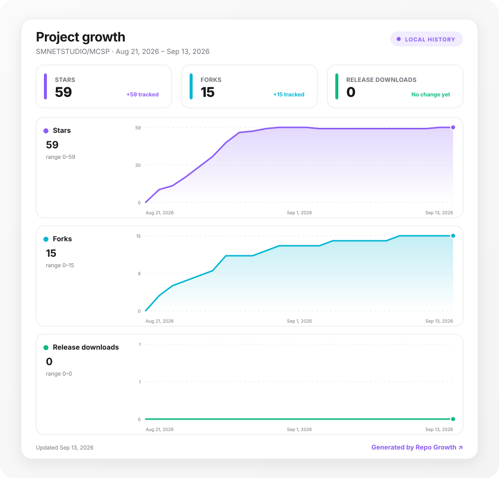

<div align="center">

# ⛏️ MCSP

**MineCraft Server Panel** · 像素风 / 液态玻璃双主题的 Minecraft 服务器管理面板

在自己的机器上开服:选好版本,面板从官方源下载服务端并拉起 `java -jar` 子进程 ——
控制台、玩家列表、CPU/内存曲线都来自这个进程本身。Java 不用预装,没有公网 IP 也能让朋友进服。

Run Minecraft servers on your own box: pick a version, MCSP fetches it from the official source
and starts a real `java -jar` child process — the console, player list and CPU/RAM charts all come
from that process. No Java pre-install, no public IP required.

10 种服务端 · 6 种内网穿透 · 一键装 Java · authlib-injector 外置登录 · 多租户配额<br>
10 server types · 6 tunnels · one-click Java · external auth · multi-tenant quotas

[功能 Features](#-功能-features) · [快速开始 Quick Start](#-快速开始-quick-start) · [架构 Architecture](#-架构-architecture) · [验收 Acceptance](#-验收-acceptance) · [许可证 License](#-许可证-license)

[](https://github.com/SMNETSTUDIO/MCSP/actions/workflows/ci.yml) [](https://github.com/SMNETSTUDIO/MCSP/actions/workflows/docker.yml) [](https://linux.do/) [](https://t.me/smnet_group/107110)

   

</div>

---

## ✨ 功能 Features

| 中文 | English |
|------|---------|
| 🔐 scrypt 哈希 + HttpOnly 会话 + 登录限速;**自定义 OAuth2 登录**(任意提供商,自动建号/绑定,state 防 CSRF) | scrypt hashing + HttpOnly sessions + login rate-limit; **custom OAuth2 login** (any provider, auto-register/bind, CSRF-safe state) |
| 📦 10 种服务端官方源安装:Paper / Purpur / Folia / Vanilla / Fabric / Forge / NeoForge / Velocity / Waterfall / BungeeCord,新老版本全支持 | 10 server types from official sources; Forge/NeoForge run the official installer; legacy versions supported (Vanilla back to 1.2.5) |
| ☕ 面板内**一键安装 Java**(Temurin 25/21/17/8),按 MC 版本自动匹配运行时 | **One-click Java install** (Temurin 25/21/17/8), auto-matched to the MC version |
| 🎮 外置登录:**authlib-injector** 自动下载 + `-javaagent` 注入,对接 LittleSkin 等 Yggdrasil 皮肤站 | External auth: auto-downloaded **authlib-injector** injected via `-javaagent`, works with LittleSkin & any Yggdrasil API |
| ❯_ 控制台 = 真实 stdout 流(SSE)+ stdin 命令(↑↓ 历史);玩家/封禁/白名单/OP 均为真实数据 | Console = real stdout stream (SSE) + stdin commands; players/bans/whitelist/OP are real server data |
| ⇄ 六种内网穿透:**bore / playit.gg / Pinggy / Serveo / ngrok / frpc**,每实例独立隧道、公网地址自动解析;frpc 支持 **frps-panel** 多用户鉴权(user + metadatas.token) | 6 tunnels: **bore / playit.gg / Pinggy / Serveo / ngrok / frpc**, one tunnel per instance with auto-parsed public address; frpc supports **frps-panel** auth (user + metadatas.token) |
| 📊 指标采样自 `/proc/<pid>`:真实 CPU% / RSS 内存实时曲线 | Metrics sampled from `/proc/<pid>`: real CPU% / RSS with live charts |
| 🗀 文件管理器(路径沙箱):在线编辑 + **拖拽/多选上传**(实时进度条)+ **文件下载 / 目录打包 tar.gz 下载**、✦ 插件启停(`.jar ⇄ .jar.disabled`)、◍ 世界管理、◷ 计划任务 | Sandboxed file manager: online editing + **drag-and-drop / multi-file upload** with live progress + **file download / folder download as tar.gz**, plugin toggle (`.jar ⇄ .jar.disabled`), world management, scheduled tasks |
| ⧉ 真实 `tar.gz` 备份/恢复/**下载**,备份前自动 `save-all` | Real `tar.gz` backup / restore / **download**, with automatic `save-all` |
| ◉ 多租户:普通用户实例**隔离**,配额真实生效——实例数 / 内存(-Xmx 之和)/ CPU 核(taskset 绑核) | Multi-tenant: isolated user instances with enforced quotas — instance count / memory (Σ-Xmx) / CPU cores (taskset pinning) |
| 🎨 双主题:像素风(Minecraft GUI 质感)/ Apple 液态玻璃;深浅色、6 主题色、密度可调 | Two themes: pixel (Minecraft GUI) / Apple liquid glass; dark/light, 6 accent colors, density options |

## 🚀 快速开始 Quick Start

### 一行安装 One-Line Install

服务器(或 VPS)上直接复制运行,自动拉取源码 → 装 Node → 装依赖 → PM2 常驻:

```bash
bash -c "$(curl -fsSL https://raw.githubusercontent.com/SMNETSTUDIO/MCSP/main/scripts/install.sh)"
```

自定义安装目录 / 端口:

```bash
bash -c "$(curl -fsSL https://raw.githubusercontent.com/SMNETSTUDIO/MCSP/main/scripts/install.sh)" -- --dir ~/mcsp --port 8080
```

### Docker 一键部署 One-Click Deploy

```bash
docker compose up -d --build
# 或直接使用镜像 or use the prebuilt image
docker run -d --name mcsp -p 3000:3000 -p 25565:25565 \
  -v mcsp-data:/app/data -v mcsp-instances:/app/instances \
  -v mcsp-backups:/app/backups -v mcsp-bin:/app/bin \
  ghcr.io/smnetstudio/mcsp:latest
```

打开 / Open `http://localhost:3000`,默认账户 / default account **`admin` / `admin123`**(请立即修改 / change it immediately)。

### 一键脚本 Script Deploy

```bash
bash scripts/deploy.sh                 # 自动装 Node(缺失时)→ 装依赖 → PM2 常驻 → 健康检查
bash scripts/deploy.sh --port 8080     # 自定义端口 custom port
bash scripts/deploy.sh --foreground    # 前台运行(调试)foreground (debug)
```

### 手动启动 Manual

```bash
# 依赖 Requirements: Node.js ≥ 18, Linux(指标读取 /proc)
npm install
npm start                    # http://localhost:3000
npm run pm2                  # 或 PM2 常驻 or run under PM2
```

- **Java 无需预装**:登录面板 → 总览 → Java →「⬇ 一键安装」,自动下载 Temurin 25/21/17/8 到 `bin/java/`,实例启动按 MC 版本自动匹配(26+ → 25,1.20.5+ → 21,1.17+ → 17,≤1.16 → 8)
  **No Java pre-install needed**: install Temurin from the Overview page; the runtime is auto-matched per MC version.
- 创建实例:总览 →「＋ 新建实例」→ 选版本、勾选 EULA → 自动下载安装 → 启动
- 外置登录:实例 → 设置 → 打开「外置登录」并填 Yggdrasil API(如 `https://littleskin.cn/api/yggdrasil`)
  External auth: Instance → Settings → enable and fill the Yggdrasil API URL.

## 🧱 架构 Architecture

```
浏览器 Browser ──► Express(server.js + src/)──► spawn(java -jar server.jar)× N 实例
                    │  SSE 日志/状态流 log & state stream       │ stdout 解析 / stdin 命令
                    │                                           └► /proc/<pid> 指标 metrics
                    └► 每实例独立隧道进程 per-instance tunnel(bore / playit / Pinggy / Serveo / ngrok / frpc)

src/
  app.js 装配 · auth.js 认证 · oauth.js OAuth2 · instance.js 核心领域对象
  registry.js 注册表 · tasks.js 调度 · backups.js 备份 · tunnels.js 穿透组件 · authlib.js 外置登录
  routes/  users / host / tunnel / instances
public/    原生 JS 前端,零依赖 vanilla JS frontend, zero deps
```

进程生命周期:`spawn(java …)` → 解析 stdout(`Done (…)!` 判定 running,joined/left 维护玩家表)→ `stop` 写 stdin 优雅关闭(30s 超时强杀)→ exit 复位。面板退出时向所有子进程发送 stop,保证世界落盘。

详见 / See [ARCHITECTURE.md](ARCHITECTURE.md)。

## 📁 仓库结构 Repository Structure

```
server.js              入口 entry (10 lines)
src/                   后端分层模块 backend modules
public/                前端 frontend(vanilla JS)
scripts/deploy.sh      一键部署 one-click deploy
scripts/smoke.js       npm test — 26 项真实 API 冒烟回归 real-API smoke suite
instances/<id>/        每实例一个真实服务端目录 real server dir per instance
backups/<id>/*.tar.gz  真实备份 real backups
data/                  users / sessions / instances / tasks(持久化 persisted)
Dockerfile             容器镜像 container image(node:22-slim + tar/ssh/taskset)
ecosystem.config.js    PM2 配置 PM2 config(fork + JAVA_BIN)
```

## ✅ 验收 Acceptance

```bash
npm test          # scripts/smoke.js — 对运行中的面板做 26 项真实 API 回归
                  # 26 real-API regression checks against a running panel
```

CI 在每次 push 时启动面板并跑完整冒烟;Docker 镜像由 Actions 构建并推送 GHCR。
CI boots the panel and runs the full smoke suite on every push; Docker images are built & pushed to GHCR by Actions.

## ⚠️ 提示 Notes

- 安装服务端时写入 `eula=true`,代表**你**同意 [Minecraft EULA](https://aka.ms/MinecraftEULA)(创建实例时需勾选确认)。
  Installing a server writes `eula=true`, meaning **you** accept the Minecraft EULA (confirmed at instance creation).
- 面板未内置 HTTPS/反代,公网部署请置于 Nginx/Caddy 之后并修改默认密码。
  No built-in HTTPS/reverse proxy — put it behind Nginx/Caddy and change the default password before going public.
- 内网穿透与外置登录组件(bore/frpc/ngrok/playit、authlib-injector)均从官方源下载,遵守各自服务条款。
  Tunnel & auth components are downloaded from official sources; comply with their respective terms.

## 📄 许可证 License

[Apache-2.0](LICENSE)

---

## 📈 项目增长 Project Growth

<p align="center">
  <a href="https://github.com/MacRimi/repo-growth">
    
  </a>
</p>

*由 [repo-growth](https://github.com/MacRimi/repo-growth) 每日自动更新 / Updated daily by repo-growth.*
